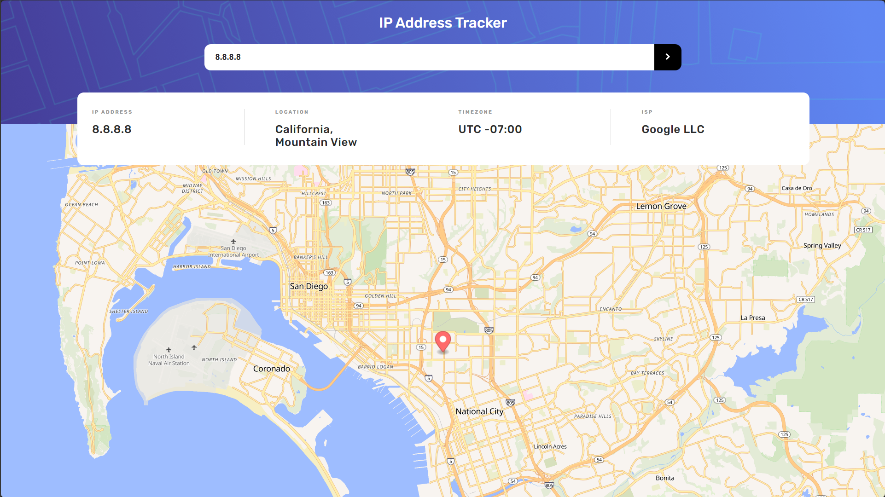
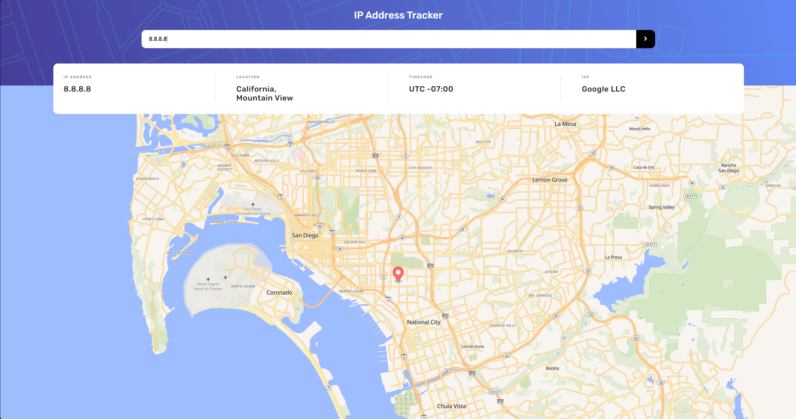
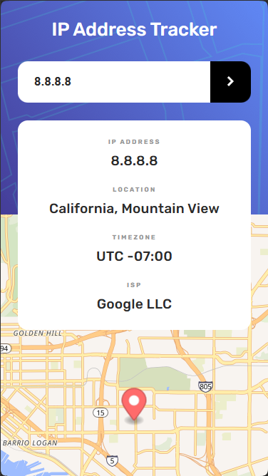

# Frontend Mentor - IP address tracker


[English](README.md) | [Russian](README.ru.md)

## Table of contents

- [Frontend Mentor - IP address tracker](#frontend-mentor---ip-address-tracker)
  - [Table of contents](#table-of-contents)
  - [Overview](#overview)
    - [The challenge](#the-challenge)
    - [Screenshots](#screenshots)
    - [Links](#links)
  - [Built with](#built-with)
    - [Third‑party services](#thirdparty-services)
  - [Quick start](#quick-start)
    - [Prerequisites](#prerequisites)
    - [Installation and setup](#installation-and-setup)
    - [Production build](#production-build)
    - [Deploy to GitHub Pages](#deploy-to-github-pages)
  - [Project structure](#project-structure)
  - [How the application works](#how-the-application-works)
    - [BEM methodology](#bem-methodology)
    - [IP validation](#ip-validation)
  - [Author](#author)

## Overview

### The challenge

Create an application for tracking IP addresses that is as close as possible to the design located in the `/design` folder. The design is presented in static JPG format. Using JPG files will require self‑selection of styles such as `font‑size`, `padding` and `margin`.

All necessary resources are located in the folder `/images`. The resources have already been optimized. There is also a file `style-guide.md`, containing the necessary information, such as the color palette and fonts.

To get the location of IP addresses, you must use the [IP Geolocation API from IPify](https://geo.ipify.org/). Otherwise, you can use any tools you like to complete the task.

The user should be able to:

- View the optimal layout of each page based on the screen size of their device;
- see the status when hovering over all interactive elements on the page;
- Search for any IP addresses or domains and see key information and location.

### Screenshots

|                           Full-screen mode (FullHD)                            |
| :----------------------------------------------------------------------------: |
|  |

|                                  2K (2560px)                                  |                              Mobile view (375px)                              |
| :---------------------------------------------------------------------------: | :---------------------------------------------------------------------------: |
|  |  |

### Links

The website is available via the link: https://zendrolya.github.io/ip-address-tracker/

## Built with

| Technology                                           | Version   | Purpose                                                                                                   |
| :--------------------------------------------------- | :-------- | :-------------------------------------------------------------------------------------------------------- |
| **[Vite](https://vite.dev/)**                        | `^8.1.1`  | Bundler and dev server. Instant module loading, hot code replacement, fast production build via Rolldown. |
| **[MapLibre GL](https://maplibre.org/)**             | `^5.24.0` | Interactive map rendering. Open‑source fork of Mapbox GL JS with no dependency on paid APIs.              |
| **Vanilla JS (ES Modules)**                          | —         | Application logic without frameworks. Native ES modules, Fetch API, DOM manipulation.                     |
| **CSS (BEM)**                                        | —         | Styling following the BEM methodology. Responsive layout using CSS custom properties and variable fonts   |
| **[IPify Geo API](https://geo.ipify.org/)**          | —         | Retrieve geolocation data by IP address or domain.                                                        |
| **[OpenFreeMap Tiles](https://openfreemap.org/)**    | —         | Free map tiles for displaying on MapLibre.                                                                |
| **[Rubik](https://fonts.google.com/specimen/Rubik)** | —         | Project font (weights 400, 500, 700).                                                                     |


### Third‑party services

| Service           | Description                                                                                                                                 |
| :---------------- | :------------------------------------------------------------------------------------------------------------------------------------------ |
| **IPify Geo API** | REST API for determining IP, location, timezone and ISP. Used in `country,city` parameters. Requires an API key (`VITE_GEO_IPIFY_API_KEY`). |
| **OpenFreeMap**   | Provides free OSM tiles in `liberty` style for rendering the MapLibre map.                                                                  |

## Quick start

### Prerequisites

- **Node.js** ≥ 18
- npm, yarn or pnpm

### Installation and setup

1. Clone the repository

```bash
# 1. Clone the repository
git clone https://github.com/zendrolya/ip-address-tracker.git
cd ip-address-tracker
```

2. Install dependencies

```bash
npm install
```

3. Create a .env file and add the IPify API key

```bash
# edit .env and insert your key:
VITE_GEO_IPIFY_API_KEY=your_key
```

4. Start the dev server

```bash
npm run dev
```

### Production build

```bash
npm run build
```

The output will be in the `dist/` directory.

### Deploy to GitHub Pages

```bash
npm run deploy
```

The script builds the project and publishes the contents of `dist/` to the `gh-pages` branch.

## Project structure

```
ip-address-tracker/
├── images/                    # Source images (icons, background)
├── screenshots/               # Screenshots for README
├── design/                    # Design mockups (JPG)
├── src/
│   ├── fonts/                 # Rubik fonts + font.css
│   ├── scripts/
│   │   ├── index.js           # Entry point: form handling, API requests
│   │   ├── map.js             # MapLibre initialization and update
│   │   └── validate-ip.js     # IPv4 address validation with regular expression
│   └── styles/
│       ├── variables.css      # CSS custom properties (colors, sizes)
│       ├── style.css          # Main styles (mobile version)
│       └── desktop.css        # Desktop styles (≥1024px)
├── index.html                 # HTML entry point
├── vite.config.js             # Vite configuration
├── package.json               # Dependencies and scripts
├── .env                       # Environment variables (API key) (must be created)
├── style-guide.md             # Frontend Mentor style guide
└── todo.md                    # Brief project development plan
```

## How the application works

1. **On page load** a MapLibre map is initialized with a view of Moscow (default).
2. **The user enters** an IP address in the search form.
3. **Validation**: `validate-ip.js` checks the address with an IPv4 regular expression.
4. **API request**: if the IP is valid, a request is made to `geo.ipify.org/api/v2/country,city` to fetch location data.
5. **Display results**: IP, region, city, postal code, timezone and ISP are printed on the page.
6. **Map updates**: the `flyTo()` function smoothly moves the camera to the found coordinates and places the marker at the location.

### BEM methodology

All CSS classes follow the [Block‑Element‑Modifier (BEM)](https://en.bem.info/) methodology:

```
.header
.header__title
.header__form
.header__input
.header__btn
.info__element
.info__element-title
.info__element-text
.footer__attribution
.footer__link
```

### IP validation

The `validateIp()` function checks whether the entered value conforms to the IPv4 format. If the input is invalid, the user receives an `alert()` notification.

## Author

**Ilya Drozdenko** — [@zendrolya](https://github.com/zendrolya)

Project created as part of the [Frontend Mentor](https://www.frontendmentor.io/) code challenge.
